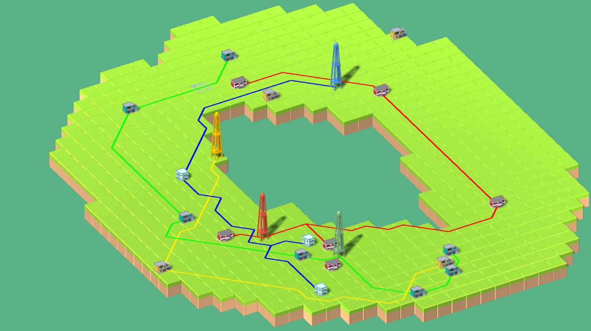

# Connectopia

## Предыстория
После большого взрыва в простанстве возникли новые живые организмы: <<электрончики>>.

На первый день ЭлектроБог создал Землю, состоящую из квадратных участов.
На второй день ЭлектроБог научил электрончиков возводить здания. И дал им ЭлектроБог электровышки.
На третий день ЭлектроБог научил рабов своих проводить логистические пути между сооружениями.
На четвёртый день ЭлектроБог разделил своих подданных по расовым признакам.
На пятый день ЭлектроБог подарил электрончикам способность перемещаться между мирами.
На шестой день ЭлектроБог научил рабов своих видеть невидимое и слышать музыку.
На седьмой день ЭлектроБог отдыхал и наблюдал за кропотливым трудом своих подданных.

## Суть игры
Каждый уровень состоит из нескольких раундов, на каждом из которых случайным образом на карте появляются дома. Также на карте находятся электровышки, которые необходимо соединить с домами соответствующего цвета. Когда все текущие дома соединены с вышками такого же цвета, раунд заканчивается и начинается следующий. Когда все раунды пройдены, начинается новая игра в новом мире.

## Правила игры
В каждой клетке карты разрешено находиться только дорогам одного цвета, следовательно, Вы не сможете провести две дороги разного цвета в одну и ту же точку. При этом разрешено пересекать дороги <<по диагонали>>, то есть ситуации, когда учаски дороги пересекаются в середине, разрешены.